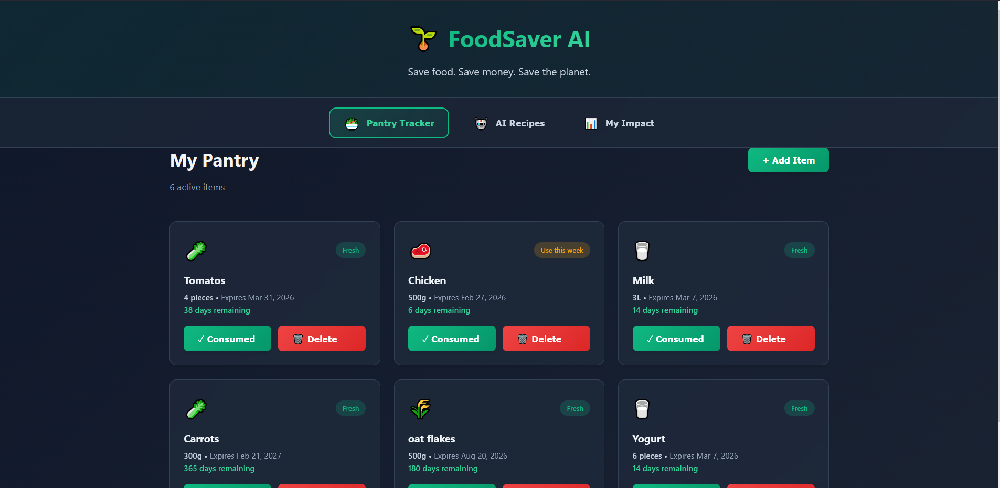
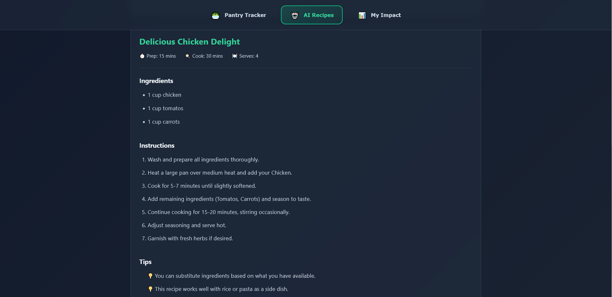
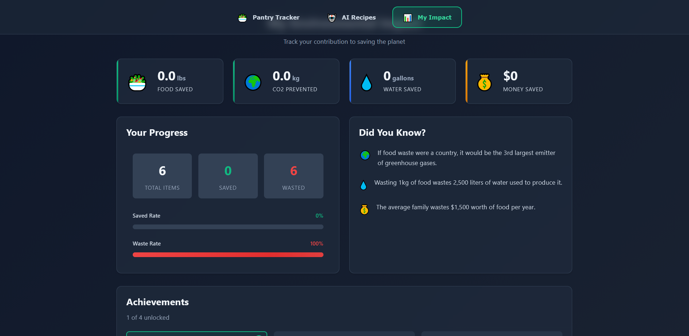

# FoodSaver AI 🌱

[](https://hack-for-humanity-26.devpost.com/)

**Reduce household food waste by 40% with AI-powered tracking and smart recipe suggestions.**

## 🎯 The Problem

Every year, households waste **40% of purchased food**, contributing to 8-10% of global greenhouse gas emissions. If food waste were a country, it would be the third-largest emitter of greenhouse gases globally.

## 💡 Our Solution

FoodSaver AI helps households reduce food waste through three intelligent features:

- **🥗 Smart Pantry Tracker**: Track food items and receive alerts before they expire
- **🤖 AI Recipe Generator**: Get personalized recipes using ingredients about to spoil
- **📊 Impact Dashboard**: Visualize your environmental impact with real-time metrics

## 📸 Screenshots

### 🥗 Smart Pantry Tracker



### 🤖 AI Recipe Generator


### 📖 Recipes



### 📊 Impact Dashboard



## 🚀 Getting Started

### Prerequisites

- Node.js (v14 or higher)
- npm or yarn
- OpenAI API key (for recipe generation)

### Installation

```bash
# Clone the repository
git clone https://github.com/WhiiteRose/FoodSaver-AI.git
cd FoodSaver-AI

# Install dependencies
npm install

# Create .env file with your OpenAI API key
echo "VITE_OPENAI_API_KEY=your_api_key_here" > .env

# Start the development server
npm run dev
```

The app will open at [http://localhost:5173](http://localhost:5173)

## ⚙️ CI/CD (GitHub Actions)

This repository now includes:

- **CI**: `.github/workflows/ci.yml`
  - Runs on `push` and `pull_request`
  - Installs dependencies and builds the app
- **CD Vercel**: `.github/workflows/deploy-vercel.yml`
  - Preview deploys on Pull Requests
  - Production deploy on the default branch (`main` or `master`)

### Vercel setup

Add these repository secrets in GitHub (`Settings > Secrets and variables > Actions`):

- `VERCEL_TOKEN`
- `VERCEL_ORG_ID`
- `VERCEL_PROJECT_ID`

How to get IDs quickly:

```bash
npx vercel link
cat .vercel/project.json
```

Then push to trigger deployment.

## 🛠️ Built With

- **React** - Frontend framework
- **Vanilla CSS** - Styling with modern animations
- **OpenAI API** - AI-powered recipe generation
- **Chart.js** - Data visualization
- **Local Storage** - Client-side data persistence

## 🌍 Environmental Impact

If just 10,000 households reduce food waste by 30%, we could prevent:

- **1,500 tons** of annual food waste
- Equivalent to removing **500 cars** from the road for a year
- Conservation of thousands of gallons of water

## 📝 Features

### Smart Pantry Tracker

- Add food items with expiration dates
- Categorize items (produce, dairy, meat, etc.)
- Get notifications for expiring items
- Quick-add common foods

### AI Recipe Generator

- Generate recipes based on expiring ingredients
- Dietary preference support
- Save favorite recipes
- Share recipes with friends

### Impact Dashboard

- Track food saved (pounds)
- CO2 emissions prevented
- Water conserved
- Money saved
- Achievement badges and milestones

## 🎮 Usage

1. **Add Food Items**: Click "Add Item" and enter your food details
2. **Get Alerts**: Receive notifications when items are about to expire
3. **Generate Recipes**: Click "Get Recipe" to create meals from expiring ingredients
4. **Track Impact**: View your environmental contribution in the dashboard

## 🤝 Contributing

This is a hackathon project, but contributions are welcome!

1. Fork the repository
2. Create your feature branch (`git checkout -b feature/AmazingFeature`)
3. Commit your changes (`git commit -m 'Add some AmazingFeature'`)
4. Push to the branch (`git push origin feature/AmazingFeature`)
5. Open a Pull Request

## 📄 License

This project is licensed under the MIT License.

## 👥 Team

Created for Hack for Humanity 2026 Hackathon

## 🙏 Acknowledgments

- Hack for Humanity organizers
- OpenAI for their API
- The open-source community

---

**Together, let's make a difference one meal at a time! 🌍💚**
